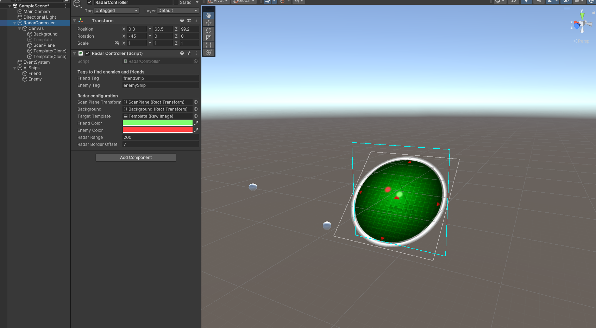

# Space Radar

Implementation of space radar for Unity with example scene for BuiltIn renderer, build with Unity 2022.3 (But no any special features were used).

## Features

- Configurable scan plane
- Lookup friend/enemy targets by tags
- Configurable radar range
- Works in both Edit and Play mode  
- Contains implementation of pool of UI objects used in radar canvas

